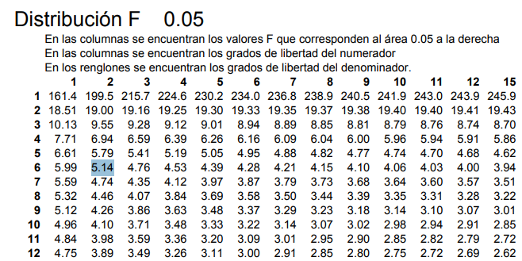
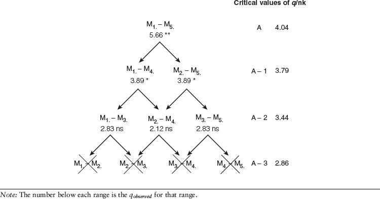

```{r, echo=FALSE}
htmltools::tagList(rmarkdown::html_dependency_jquery())
```


```{r, include=FALSE, warning=FALSE, eval=FALSE}
library(xaringanthemer)
style_mono_accent(
  base_color = "#5E2129",
  code_highlight_color = "#E3906F", 
  code_inline_color = "#0E2B54",
  text_font_size = "1.3rem",
  
)
```

```{r, xaringanExtra-clipboard, echo=FALSE}
htmltools::tagList(
  xaringanExtra::use_clipboard(
    button_text = "<i class=\"fa fa-clipboard\"></i>",
    success_text = "<i class=\"fa fa-check\" style=\"color: #90BE6D\"></i>",
  ),
  rmarkdown::html_dependency_font_awesome()
)

xaringanExtra::use_logo(
  image_url = "https://www.ciisder.mx/images/logos/logo_uatx_2019.png",
  position = xaringanExtra::css_position(top = "1em", right = "1em")
)

xaringanExtra::use_tile_view()

xaringanExtra::use_share_again()


```


```{r, echo=FALSE, warning=FALSE, message=FALSE}
library(tidyverse)
```

# Contenido

+ Análisis de varianza - ANOVA

+ Pruebas de comaparaciones múltiples para ANOVA

+ Tukey

+ ANOVA de dos vías

+ ANOVA para medidas repetidas

    
---
## Análisis de varianza - ANOVA

<uw-blockquote> Este análisis lo realizamos para medir el **efecto de una o más variables independientes** (cada uno con más de dos niveles) sobre la media de **una variable continua**.

---
## Ejemplo ANOVA - manual

Un profesor quiere saber si tres métodos de enseñanza diferentes (A, B, C) producen notas distintas en un examen. Toma una muestra pequeña de 3 alumnos por método. 
Notas obtenidas (Variable dependiente: Nota | Factor: Método):
- *Método A:* 6, 8, 7
- *Método B:* 9, 10, 8
- *Método C:* 4, 6, 5

---
## Ejemplo ANOVA - manual

- **Paso 1: Formular Hipótesis**

$H_{0}$ (Hipótesis Nula): Las medias son iguales. El método no afecta la nota.

$H_{1}$ (Hipótesis Alternativa): Al menos una media es diferente. Un método es diferente. 

---
## Ejemplo ANOVA - manual

- **Paso 2: Calcular medias de grupos y media general**

Media Método A ($\bar{X}_{A}$): $(6+8+7)/3 = 7$ 

Media Método B ($\bar{X}_{B}$): $(9+10+8)/3 = 9$ 

Media Método C ($\bar{X}_{C}$): $(4+6+5)/3 = 5$ 

Media General ($\bar{X}$): $(7+9+5)/3 = 7$
---
## Ejemplo ANOVA - manual

- **Paso 3: Calcular Suma de Cuadrados (SC) **

 + **Suma de Cuadrados Entre Grupos (SCT)**: Mide cuánto difieren las medias de los grupos de la media general.

Fórmula: $n\Sigma(\bar{x}_{k}-\bar{x})^2$

$3 * [(7-7)^2 + (9-7)^2 + (5-7)^2]$

$3 * [(0)^2 + (2)^2 + (-2)^2]$

$3 * [0+4+4] = 3*8 = 24$

---
## Ejemplo ANOVA - manual

 + **Suma de Cuadrados Dentro de Grupos (SCE)**: Mide la variabilidad dentro de cada método.

Fórmula: $\Sigma(x_{k}-\bar{x_{k}})^2$
 
**Grupo A:** $(6-7)^2 + (8-7)^2 + (7-7)^2 = 1+1+0 = 2$

**Grupo B:**  $(9-9)^2 + (10-9)^2 + (8-9)^2 = 0+1+1 = 2$

**Grupo C:** $(4-5)^2 + (6-5)^2 + (5-5)^2 = 1+1+0 = 2$

 $SCE = 2+2+2 = 6$
---
## Ejemplo ANOVA - manual

- **Paso 4: Calcular los grados de libertad (gl) **

$gl_{entre}= k-1 = 3-1 = 2$

$gl_{dentro}= N- k= 9-3 = 6$

**Paso 5: Calcular Cuadrados Medios**

$SCT/k-1 = 24/2 = 12$

$SCE/N-k = 6/6 = 1$


**Paso ¿65: Calcular el estadístico F**

$F = 12/1 = 12$

---
## Ejemplo ANOVA - manual

**Paso 7: Interpretar el resultado**

F Calculado: 12

F Crítico (Tabla F): Buscamos con 2 y 6 grados de libertad y nivel de confianza 0.05. 
```{r, echo=FALSE}

```

---
## Ejemplo ANOVA - manual

Conclusión: Como F calc > F crit, rechazamos la hipótesis nula.

Significado: Hay una diferencia significativa en las notas dependiendo del método


---


## Pruebas de comparaciones múltiples para ANOVA

<uw-blockquote> *post hoc* viene del latín y significa **para después de esto**. 

<uw-blockquote> Las pruebas *post hoc* se realizan después de que se ha establecido un efecto significativo de un factor

---
## Pruebas de comparaciones múltiples para ANOVA

<uw-blockquote> Se usa para obtener más información sobre la naturaleza de un efecto, es decir, ¿qué niveles del factor están asociados con puntajes más altos o más bajos?

<uw-blockquote> Las pruebas *post hoc* pueden ayudar a contar la historia de los datos más allá de una simple diferencia.
---
## Pruebas de comparaciones múltiples para ANOVA
- Para identificar las diferencias hay que comparar dos a dos las medias de todos los grupos introducidos en el análisis mediante pruebas que comparen 2 grupos, a esto se le conoce como análisis *post-hoc*.

- Los niveles de significancia pueden ser ajustados en función del número de comparaciones. Debido a la inflación del error de tipo I, cuantas más comparaciones se hagan más aumenta la probabilidad de encontrar diferencias significativas. 

---
### Pruebas de comparaciones múltiples para ANOVA
La siguiente tabla ilustra cuántas comparaciones por pares están asociadas con cada número de grupos junto con la tasa de error por familia:

```{r, echo=FALSE, fig.align='center'}
knitr::include_graphics("https://statologos.com/ezoimgfmt/fourpillarfreedom.com/wp-content/uploads/2019/04/post_hoc1.jpg?ezimgfmt=rs:386x298/rscb1/ng:webp/ngcb1")
```


---
# Tukey - HSD

<uw-blockquote> La prueba de **diferencia honestamente significativa** (HSD) de Tukey es una forma de determinar si la diferencia entre dos medias de condición es (honestamente) significativa. 

<uw-blockquote> La prueba de Tukey es muy similar a un t-test, excepto que corrige la tasa de error del experimento. Esto lo consigue empleando un estadístico que sigue una distribución llamada **studentized range distribution** en lugar de una distribución t. 

---
# Tukey - HSD

- El estadístico de prueba para la prueba HSD de Tukey es el estadístico de rango estudentizado $HSD$ se define como:
$$
\begin{aligned}
HSD_{crítico}=q_{crit, \alpha,k, N-k}\sqrt{\frac{CME}{n}}
\end{aligned}
$$
- Dónde: $q_{crit, \alpha,k, N-k}$ es el valor crítico q, CME es la suma de cuadrados del error calculado anteriormente y n el número de observaciones de un grupo.

- La diferencia entre cada promedio de grupos se compara con el valor obtenido de $HSD$ y los valores mayores que este son considerados significativos.

---
# Tukey - HSD

- La otra forma es calcular el valor observado de $q$ y compararlo directamente con el valor $q_{crítico}$ siguiendo la misma lógica que el valor observado debe ser mayor al valor crítico para ser considerado significativo. La fórmula del valor observado es:
$$
\begin{aligned}
q_{observado}= \frac{\bar{x_{1}}- \bar{x_{2}}}{\sqrt{\frac{CME}{n}}}
\end{aligned}
$$


- Para calcular los intervalos de confianza, se realiza con la siguiente fórmula:

$$
\begin{aligned}
(\bar{x_{1}}-\bar{x_{2}})\pm q_{crit}\sqrt{CME/n}
\end{aligned}
$$

- Dónde $\bar{x_{1}}-\bar{x_{2}}$ es la diferencia entre las medias de los dos grupos que se están comparando y los demás parámetros son idénticos a los calculados en la fórmula del $HSD$.

---
## Ejemplo aplicado
```{r, echo=FALSE, fig.align='center'}
knitr::kable(datos, align = "c")
```
---
## Ejemplo aplicado
.pull-left[
```{r}
qcri<-qtukey(p = 0.95, nmeans = 4, df = 16)

sqme<- sqrt(CME/5)

HSD_val<- qcri*sqme


qcri; HSD_val
```


```{r}
dif1<- mean(datos$Tratamiento3)-mean(datos$Tratamiento1)
dif2<- mean(datos$Tratamiento2)-mean(datos$Tratamiento1)
dif3<- mean(datos$Tratamiento4)-mean(datos$Tratamiento1)
dif4<- mean(datos$Tratamiento2)-mean(datos$Tratamiento3)
dif5<- mean(datos$Tratamiento4)-mean(datos$Tratamiento3)
dif6<- mean(datos$Tratamiento4)-mean(datos$Tratamiento2)

```


]

.pull-right[
```{r}
dif1>HSD_val;dif2>HSD_val;dif3>HSD_val;dif4>HSD_val;dif5>HSD_val;dif6>HSD_val
```

]

---
## Ejemplo aplicado
```{r}
up<-dif1+(qcri*sqme)
low<-dif1-(qcri*sqme)
data.frame(up,low)
```

---
## Ejemplo aplicado

```{r}
anov<- aov(Valor~Tratamiento,data = datost)
TukeyHSD(anov, "Tratamiento", ordered = T)
```
---
## Ejemplo aplicado

.pull-left[
```{r, fig.align='center', fig.height=6}
plot(TukeyHSD(anov, "Tratamiento", ordered = T))
```
]

.pull-right[
```{r, fig.align='center', fig.height=5}
library(agricolae)
hsd_agricolae<-HSD.test(anov, "Tratamiento", group = TRUE)
plot(hsd_agricolae)
```

]
---
### Newman-Keuls (student)

+ Es una prueba *post hoc* para probar las diferencias en las medias de varios grupos. Se realiza después que una ANOVA haya dado significativo y sé usa para identificar qué par de medias son diferentes. La prueba se basa también en la **distribución de rango estudentizada**.

- El método Newman-Keuls fue introducido por Newman en 1939 y desarrollado por Keuls en 1952.

+ Las hipótesis que manjea son:
 - $H_{o}$: media 1 = media 2
 - $H_{a}$: media 1 ≠ media 2

---
#### Newman-Keuls
1. Ordenar las medias de la más grande a la más pequeña.
2. Calcular el error estándar como anteriormente $\sqrt{\frac{CME}{n}}$
3. Cacular el valor crítico *q* con la fórmula:
$q_{crítico} = \frac{\bar{x_{1}}-\bar{x_{2}}}{S_{12}}$
4. Encontrar el valor crítico en la tabla de valores críticos con los $k$ y los grados de libertad del error. [Tabla1](https://elvers.us/stats/tables/qprobability.html), [Tabla2](https://www.statisticshowto.com/studentized-range-distribution/#qtable) `r fontawesome::fa("link", fill = "#103261")`
  - Si las dos primeras medias no son diferentes entonces para la prueba
  - Si la dos primeras son diferentes sigue con los siguientes pares de medias desde el paso 2, para cuando no encuentres diferencias.
5. En cada comparación de medias corrige los grados de libertad según el número de grupos comparados. 

---
#[Newman-Keuls](https://methods.sagepub.com/reference/encyc-of-research-design/n266.xml) `r fontawesome::fa("link", fill = "#103261")`

```{r,echo=FALSE}

```


---

```{r, out.height=5, out.width="80%"}
library(agricolae)
SNK.test(anov, "Tratamiento", console = TRUE)
```

---

```{r, fig.align='center'}
library(agricolae)
snk<-SNK.test(anov, "Tratamiento", console = FALSE)
plot(snk)
```


---
## Tukey-HSD vs Newman-Keuls

- Aunque el punto importante de las pruebas *post hoc* es disminuir los errores tipo I, en algunos casos Newman-Keuls con más de 4 grupos incrementa ligeramente este tipo de error en mayor medida que Tukey-HSD.

- Newman-Keuls trabaja de forma secuencial por lo que por esta razón no puede producir intervalos de confianza al 95% para cada diferencia ni valores de p justados como lo hace Tukey-HSD.

- Newman-Keuls es más conservadora que Tukey-HSD por su umbral móvil y el valor de alfa o significancia es el mismo del ANOVA (0.05).

---
## Prueba de Duncan

+ Es una variante de Newman-Keuls pero a diferencia de esta, usa niveles de alfa que se van incrementando en cada paso del procedimiento, siendo menos suceptible a errores de Tipo I.

- Fue propuesto por David B. Duncan en 1955 como una modificación del método anterior pero con más poder estadístico. 

- El resultado de la prueba es un conjunto de subconjuntos de medias, donde en cada subconjunto se ha encontrado que las medias no son significativamente diferentes entre sí.

- Tiene los mismos supuestos que las anteriores y requiere un resultado significativo en el ANOVA.


---
### Prueba de Duncan
1. Ordenar las medias de la más grande a la más pequeña.
2. Cacular el valor crítico *q*, aquí denominad como $r$, como las pruebas anteriores
3. Encontrar el valor crítico en la tabla de valores críticos con los $k$ y los grados de libertad del error. 
4. Calcular el valor crítico de Duncan, denotado por:

$$
\begin{aligned}
R_{(k,\nu,\alpha_{p})}=r_{k, \alpha_{p},k, v}\sqrt{\frac{CME}{n}}
\end{aligned}
$$

---
### Prueba de Duncan

- Este $r$ (antes $q_{crítico}$) es variable como anteriormente vimos en la prueba de Newman-Keuls y las diferencias de los promedios:
  - Si las dos primeras medias no son diferentes entonces para la prueba
  - Si la dos primeras son diferentes sigue con los siguientes pares de medias desde el paso 2, para cuando no encuentres diferencias.
  - En cada comparación de medias corrige los grados de libertad por comparaciones

---
### Prueba de Duncan
Además de estos pasos que lucen muy parecidos a la prueba de Newman-Keuls este método introduce además una significancia o $\alpha$ variable, esto como un **"nivel de protección"**:

$$
\begin{aligned}
\alpha_{p}=1-(1-\alpha)^K-1
\end{aligned}
$$

||Nivel de protección alfa| probabilidad de error tipo I|
|:-:|:-----------------------:|:-----------------------------:|
|k=2|0.95|0.05|
|k=3|0.95|0.097|
|k=4|0.95|0.143|
|k=5|0.95|0.185|
|k=6|0.95|0.226|

---

```{r}
library(agricolae)
duncan.test(anov, "Tratamiento", console = TRUE)
```


---
```{r, fig.align='center'}
library(agricolae)
duncan<-agricolae::duncan.test(anov, "Tratamiento")
plot(duncan)
```


---
# Duncan vs Newman-Keuls

- La prueba de Duncan está basado en Newman-Keuls, éste último no protege la tasa de error familiar (tipo I) como Duncan con su alfa variable

- La prueba de Duncan entonces intencionalmente sube los niveles del alfa en cada paso del procedimiento de Newman-Keuls

- Por estas subidas de los alfas muchos critican esta prueba por ser muy liberal 

---
## Otras pruebas...

- Prueba de Dunnet : comparar con un control

- Prueba de Scheffé: se aplica también con datos no balanceados

- Prueba de Fisher (LSD): mismo principio de Duncan pero con la distribución t. 

- Tukey-Kramer: para datos desbalanceados.

- Pruebas pareadas (t.test) con correcciones: Bonferroni, Holm-Bonferroni, FDR, entre otras. 

---

## 1 variable cuantitativa >2 grupos dependientes: ANOVA por bloques 
```{r, warning=FALSE, message=FALSE}
library(BHH2)
data(penicillin.data)
penicilina<- penicillin.data
str(penicilina)
```
---
```{r}
plot(yield~blend+treat, data = penicilina)
```
---
```{r}
modelo3<- lm(yield~blend+treat, data = penicilina)
```

```{r, fig.align='center'}
par(mfrow = c(2, 2))
plot(modelo3)
```

---
# Anova por bloques

```{r}
anova(lm(yield~ blend+treat,data = penicilina))
```
---

## ANOVA 2 factores fijos sin interacción y con interacción

Modelo aditivo, efectos fijos: aov(variable_respuesta \~ factor1 + factor2, data)

Modelo con interacción: aov(variable_respuesta \~ factor1 x factor2, data)

Modelo solo interacción: aov(variable_respuesta \~ factor1 : factor2, data)


---
### Ejemplo ANOVA 2 vías

Para este ejemplo usaremos el set de datos 'ToothGrowth'

```{r}
data("ToothGrowth")
dientes<- ToothGrowth
str(dientes)
```

Como podemos observar la variable de respuesta aquí sería la longitud de los dientes y los factores a evaluar son *'supp'* y *'dose'*, *supp* es la forma en que le dieron la vitamina C a los cerdos, si como OJ (jugo de naranja) o AS (ácido ascórbico) a diferentes dosis (*dose*) de 0.5, 1 y 2 mg/día.
---
### Ejemplo ANOVA 2 vías

El factor 'dose' o dosis no aparece como factor sino como variable numérica.

Esto puede ser un inconveniente al correr el ANOVA así que modificaremos esto en la data.


```{r}
dientes$dose <- factor(dientes$dose, 
                  levels = c(0.5, 1, 2),
                  labels = c("D0.5", "D1", "D2"))
head(dientes)

```

---
### Ejemplo ANOVA 2 vías

Bien, visualizaremos nuestros datos para ver las tendencias de nuestros factores sobre nuestra variable de respuesta:

```{r, message=FALSE, warning=FALSE, out.width="45%", echo=FALSE}
library(ggpubr)
ggboxplot(data = ToothGrowth, x = "supp", y = "len", fill = "supp")+theme(text = element_text(size = 40))
ggboxplot(data = ToothGrowth, x = "dose", y = "len", fill = "dose")+theme(text = element_text(size = 40))
```

---
### Ejemplo ANOVA 2 vías

.pull-left[
```{r, echo=TRUE, out.width="80%", fig.align='center'}
ggboxplot(data = ToothGrowth, x = "dose", y = "len", fill = "supp")
```
]

.pull-right[
```{r, message=FALSE, warning=FALSE, echo=TRUE, fig.height=6}
ggline(ToothGrowth, x = "dose", y = "len", color = "supp", add = c("mean_se", "jitter"))
```
]

---
### Ejemplo ANOVA 2 vías

Como pudimos ver aparentemente los factores podrían tener una interacción, en este caso podríamos correr una ANOVA dos vías o bien aditivo o bien mutiplicativo si queremos confirmar la interacción, o bien solo ver la interacción.

```{r}
anova1<- aov(len ~ supp + dose, data = dientes)
anova2<-  aov(len ~ supp * dose, data = dientes)
anova3<-  aov(len ~ supp : dose, data = dientes)

```

```{r}
summary(anova1)
```

---
### Ejemplo ANOVA 2 vías

```{r}
summary(anova2)
```


```{r}
summary(anova3)
```

---
## ANOVA 2 factores de efectos aleatorios/mixtos

```{r, message=FALSE, warning=FALSE}
library(faraway)
data(rabbit)
conejos<- rabbit
str(conejos)
```

---
```{r}
plot(gain~ block + treat, rabbit, col=456)
```
---

```{r}
#Observamos que tanto el bloque como el tratamiento son significativos.
lm.rabbit <- lm(gain~ block+treat, data=rabbit)
anova(lm.rabbit)
```
---
```{r}
# nos interesa analizar el efecto del factor (dieta) sobre la respuesta una vez que se haya tenido en cuenta la variabilidad atribuible al bloque (camada).
library(nlme)
lme.rabbit1 <- lme(gain~ treat, random=~1|block, data=rabbit)
anova(lme.rabbit1)
```

---
## ANOVA 2 factores anidados 

```{r}
df<-data.frame(crecimiento = c (13, 16, 16, 12, 15, 16, 19, 16, 15, 15, 12, 15,
                          19, 19, 20, 22, 23, 18, 16, 18, 19, 20, 21, 21,
                          21, 23, 24, 22, 25, 20, 20, 22, 24, 22, 25, 26),
                 fertilizante = factor(c(rep(c(' A ', ' B ', ' C '), each=12 ))),
                 tech = factor(c(rep(1: 9,  each=4 ))))
```

```{r}
str(df)
```

---

```{r}
summary(aov(crecimiento ~ fertilizante/tech, data = df))
```

```{r}
summary(aov(crecimiento ~ fertilizante %in% tech, data = df))
```
---
## ANOVA 2 factores fijos parcelas divididas (split plot)

En este experimento, se desean medir los efectos de tres factores sobre la cantidad de glucógeno en el hígado de ratas. En este experimento, hay 6 ratas (parcelas o plots). 
A cada rata, se le asignó al azar una de las tres dietas alimentarias (T1, T2 y T3).
De cada rata, se le extrajo el hígado y se dividió en cuatro segmentos. Cada segmento se preparó utilizando uno de dos productos químicos diferentes (P1 y P2). Finalmente, se midió el nivel de glucógeno de cada pedazo de hígado usando dos técnicas analíticas diferentes (A y B). La unidad experimental de la dieta es la rata. La unidad experimental para la preparación química del hígado es una tira de hígado. La unidad experimental de la técnica analítica es un trozo de hígado. Todos son diferentes.

---
## ANOVA 2 factores fijos parcelas divididas (split plot)

```{r, warning=FALSE, message=FALSE}
ratas<- readr::read_csv("https://raw.githubusercontent.com/Steph0522/Curso_Bioestadistica_2023/main/Modulo2/data_ratas.csv")
str(ratas)

```
---
## ANOVA 2 factores fijos parcelas divididas (split plot)

```{r, warning=FALSE, message=FALSE}
anova_factorial <- lm(glycogen ~ food * prep * method, data = ratas)
anova(anova_factorial)
```
---
```{r, warning=FALSE, message=FALSE}
anova_split <- aov(glycogen ~ food * prep * method + Error(rat/food:prep), data = ratas)
summary(anova_split)
```


---

## Análisis de medidas repetidas


Queremos realizar un análisis de medidas repetidas para los datos de rendimiento académico de seis alumnos. En cada alumno se ha medido a cinco tiempos diferentes su rendimiento, por tanto las muestras tomadas no son independientes entre si. Para poder analizar estos datos debemos considerar las muestras como relacionadas, es decir debemos realizar un ANOVA de medidas repetidas.\

```{r}
individuos<- factor(c(rep(1,5), rep(2,5), rep(3, 5),
                      rep(4, 5), rep(5,5), rep(6,5)))
tiempo<- factor(rep(1:5, 6))
rendimiento<- c(8.5, 8.2,8.9, 7.7, 7.4,
                9.8,8.9,8.9,8.8,8.1,
                9.6,9.0, 9.3, 7.5, 7.1,
                7.5, 7.8, 7.8, 4.5, 4.6,
                5.8, 5.8, 5.9, 2.6, 1.2,
                9.9, 9.8, 9.6, 8.6, 8.7)
data_rendimiento<- data.frame(individuos=individuos,
                              tiempo=tiempo, rendimiento=rendimiento)

```
---
## Análisis de medidas repetidas

```{r}
str(data_rendimiento)
```
---
## Análisis de medidas repetidas

Vamos a realizar el análisis de medidas repetidas ANOVA paramétrico por medio del paquete ez. Para ello hay que indicar nuestros datos (data), nuestra variable (dv), nuestros individuos (wid) y el tiempo (within):

---
## Análisis de medidas repetidas

**Versión paramétrica:**

```{r, warning=FALSE, message=FALSE}
library(ez)
ezANOVA(data=data_rendimiento, dv=rendimiento, wid=individuos, within=tiempo)
```


Podemos ver en nuestros resultados que el tiempo es significativo, es decir, el rendimiento escolar cambia con el tiempo. Pero en este caso nuestros datos violan uno de los requisitos que es la esfericidad (test de Mauchly significativo), debemos fiarnos de la p de la **Sphericity corrections** que nos confirma lo que hemos deducido al principio.
---
## Análisis de medidas repetidas

```{r, out.width='80%', fig.align='center'}
boxplot(rendimiento~tiempo, xlab="tiempo", 
        ylab="Rendimiento académico", 
        main="rendimiento alumnos con el paso del tiempo",
        col="blue", data=data_rendimiento)
```
---
## Análisis de medidas repetidas

**Versión no paramétrica:**\

```{r, message=FALSE, warning=FALSE, eval=FALSE}
library(tidyverse)
library(jmv)
#cambiamos el formato de la data
data_rendimiento_notidy<-data_rendimiento %>% mutate(tiempo =case_when(
  tiempo== 1 ~ "T1",
  tiempo== 2 ~ "T2",
  tiempo== 3 ~ "T3",
  tiempo== 4 ~ "T4",
  tiempo== 5 ~ "T5")) %>% pivot_wider(names_from =tiempo, 
                                      values_from = rendimiento )

jmv::anovaRMNP(data_rendimiento_notidy, measures=vars(T1,T2,T3,T4,T5))
```
---
### El día de hoy aprendimos que...
- Se utiliza un ANOVA para determinar si existe o no una diferencia estadísticamente significativa entre las medias de tres o más grupos independientes. Y hay de varios tipos.

- Si un ANOVA produce un valor p que es menor que nuestro nivel de significancia, podemos usar pruebas *post hoc* para averiguar qué medias de grupo difieren entre sí.

---
### El día de hoy aprendimos que...

- Las pruebas *post hoc* nos permiten controlar la tasa de error familiar mientras realizamos múltiples comparaciones por pares.
- La compensación de controlar la tasa de error familiar es un poder estadístico más bajo. Podemos reducir los efectos de un poder estadístico más bajo haciendo menos comparaciones por pares.
- Debe determinar de antemano en qué grupos le gustaría hacer comparaciones por pares y qué prueba post hoc utilizará para hacerlo.


---
## Referencias y material suplementario

- [Advanced Statistics I 2021 Edition](https://bookdown.org/danbarch/psy_207_advanced_stats_I/differences-between-two-things.html#sign-binomial-test)

- [Pruebas paramétricas y no paramétricas](https://enviromigration.files.wordpress.com/2016/04/pruebas-paramc3a9tricas-y-no-parametricas.pdf)

- [Estadística paramétrica y no paramétrica](https://rstudio-pubs-static.s3.amazonaws.com/724751_c45a17f9e45f464c93e94f3fb0c6d340.html#16)

- [Prácticos de bioestadística 2](https://derek-corcoran-barrios.github.io/AyduantiaStats/_book/t-student.html)
