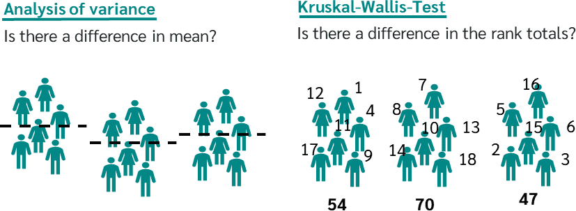
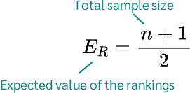
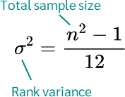
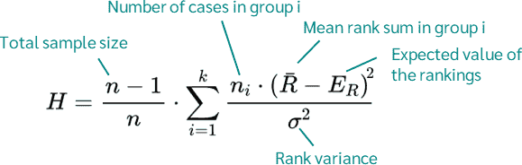
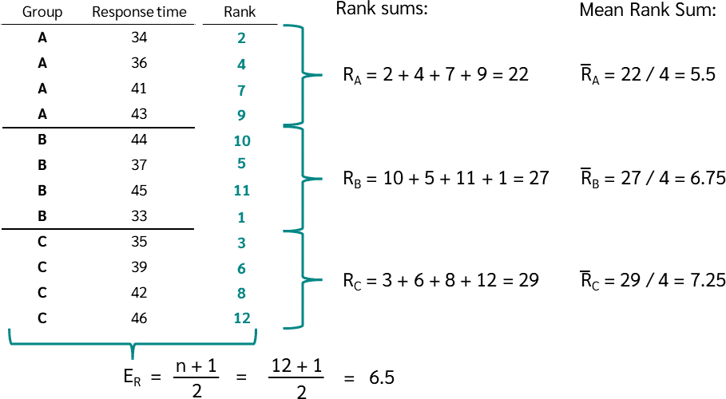
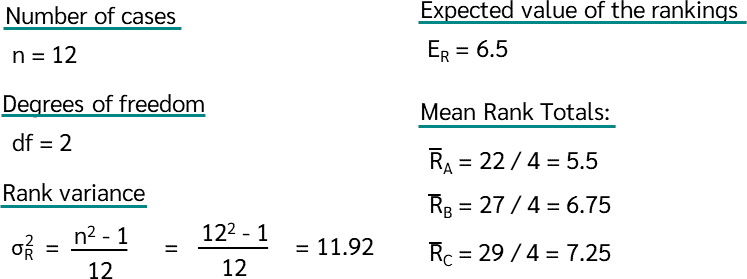
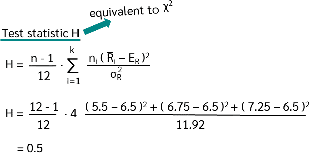
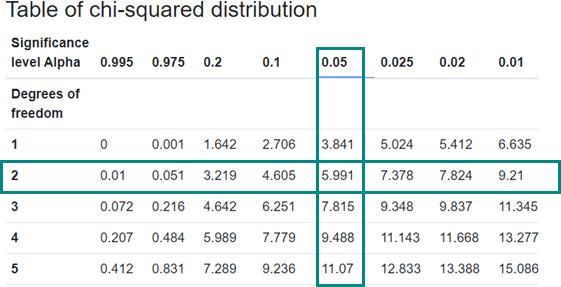
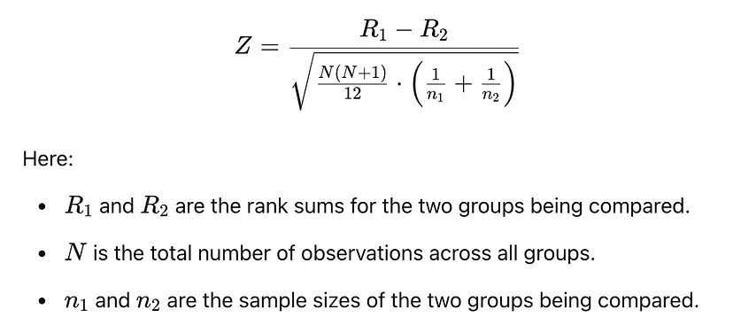

```{r, echo=FALSE}
htmltools::tagList(rmarkdown::html_dependency_jquery())
```


```{r, include=FALSE, warning=FALSE, eval=FALSE}
library(xaringanthemer)
style_mono_accent(
  base_color = "#5E2129",
  code_highlight_color = "#E3906F", 
  code_inline_color = "#0E2B54",
  text_font_size = "1.3rem",
  
)
```

```{r, xaringanExtra-clipboard, echo=FALSE}
htmltools::tagList(
  xaringanExtra::use_clipboard(
    button_text = "<i class=\"fa fa-clipboard\"></i>",
    success_text = "<i class=\"fa fa-check\" style=\"color: #90BE6D\"></i>",
  ),
  rmarkdown::html_dependency_font_awesome()
)

xaringanExtra::use_logo(
  image_url = "https://www.ciisder.mx/images/logos/logo_uatx_2019.png",
  position = xaringanExtra::css_position(top = "1em", right = "1em")
)

xaringanExtra::use_tile_view()

xaringanExtra::use_share_again()


```


```{r, echo=FALSE, warning=FALSE, message=FALSE}
library(tidyverse)
```

# Contenido

+ Pruebas no paramétricas

+ Kruskal Wallis test

+ Dunn test

+ Correcciones en pruebas *post hocs*


---
## Pruebas no paramétricas y supuestos estadísticos

- Las pruebas no paramétricas no requieren que conozcamos la distribución de nuestros datos ni parámetros de la población de estudio como su media o varianza poblacional.

- Las pruebas no paramétricas nos permiten analizar
datos en escala nominal u ordinal y en su mayoría los resultados se derivan a partir de procedimientos de ordenación y recuento, por lo que su base lógica es de fácil comprensión. 

---
## Pruebas no paramétricas y supuestos estadísticos

- Cuando trabajamos con muestras pequeñas (n < 10) en
las que se desconoce si es válido suponer la normalidad de los datos, conviene utilizar pruebas no paramétricas

- Pocos supuestos: aleatoriedad e independencia.

---
# PRUEBAS NO PARAMÉTRICAS


|VENTAJAS    | DESVENTAJAS     | 
|-------------------|-------|
| - Mayor aplicabilidad | - Eficiencia estadística menor
| - Se pueden usar variables ordinales     |- Poder estadísitico menor   | 
| - Son más fáciles de calcular     | - No se pueden evaluar interacciones| 

---
# PRUEBAS NO PARAMÉTRICAS


|TIPO    |   PRUEBA     | 
|:-------------------:|:-------:|
| Comparación de 2 grupos	  |   Wilcoxon/U Mann Withney | 
| Comparación de >2 grupos       | Kruskal-wallis | 
| Correlación de dos variables     | Coeficiente de Spearman| 
| Variables cualitativas     | Chi-cuadrada/Fisher| 

---
## Prueba de Kruskal Wallis

<uw-blockquote> La prueba de Kruskal-Wallis es un método estadístico no paramétrico propuesto por **William Kruskal** y **W. Allen Wallis** en 1952. 

<uw-blockquote> Funciona como una alternativa al **ANOVA** de un factor cuando no se cumple la normalidad, comparando las medianas de tres o más grupos independientes mediante el uso de rangos.

---
## Prueba de Kruskal Wallis (prueba H) 


- La prueba de Kruskal-Wallis se utiliza cuando no se cumplen los supuestos de un ANOVA de una vía. 

- Debido a que es una prueba no paramétrica, los datos no necesitan seguir una distribución normal.

- Los datos deben tener al menos una escala ordinal y las muestras deben ser independientes.

---
### Prueba de Kruskal-Wallis vs. ANOVA

En la prueba de Kruskal-Wallis son suficientes variables ordinales, ya que las pruebas no paramétricas analizan los rangos de los datos en lugar de los valores originales.

**Características principales**

- **No paramétrica**: no asume normalidad en los datos, por lo que es adecuada para datos que no siguen una distribución normal.

- **Datos ordinales o continuos**: puede utilizarse con datos ordinales o con datos continuos convertidos en rangos.

- **Grupos independientes**: se utiliza para comparar grupos independientes, es decir, las observaciones de cada grupo no están relacionadas. 

---
### Prueba de Kruskal-Wallis vs. ANOVA

```{r, echo=FALSE}

```

<uw-blockquote> La prueba de Kruskal-Wallis evalúa diferencias en las sumas de rangos, no directamente en las medianas. **Esta distinción es importante.**
---
## Pregunta de investigación e hipótesis


**¿Existe una diferencia en la tendencia central de varias muestras independientes?**

De esta pregunta se derivan las siguientes hipótesis:

**Hipótesis nula (H₀)**: Las muestras independientes tienen la misma tendencia central (distribución) y, por lo tanto, provienen de la misma población.

**Hipótesis alternativa (H₁)**: Al menos una de las muestras independientes no tiene la misma tendencia central (distribución) que las demás y, por lo tanto, proviene de una población diferente.
---
## Supuestos de la prueba de Kruskal-Wallis

**Para aplicar la prueba se requiere:**

1. Varias muestras aleatorias independientes.

2. Variables con escala al menos ordinal.

3. No es necesario que los datos sigan una distribución específica.

<uw-blockquote> Si las muestras no son independientes (es decir, son dependientes o repetidas), se debe usar la **prueba de Friedman**.
---
### Suma de rangos 

1. La prueba asigna rangos a todos los datos combinados de todos los grupos. 

2. Cada valor se reemplaza por su rango dentro del conjunto total.Luego se suman los rangos para cada grupo.

4. La hipótesis nula establece que el rango medio de los grupos es igual. 

5. La lógica es que, si las distribuciones son similares, diferencias en los rangos medios implican diferencias en las medianas. 

6. Para realizar la prueba se calcula la estadística H, que corresponde a una aproximación de la distribución χ² (chi-cuadrado).

El valor crítico de H se obtiene a partir de la tabla de valores críticos de χ².

---
### Cálculo de la prueba de Kruskal-Wallis

```{r, echo=FALSE}



```
---
### Ejemplo de cálculo

Supongamos que se mide el tiempo de reacción en tres grupos y se quiere determinar si existen diferencias.

1. Asignar un rango a cada observación
2. Calcular la suma de rangos 
3. Calcular el rango medio por grupo.

En el ejemplo se midió el tiempo de reacción en 12 personas, por lo que N = 12.

---
### Ejemplo de cálculo
```{r, echo=FALSE}

```
---
### Ejemplo de cálculo
```{r, echo=FALSE}

```

---
### Ejemplo de cálculo
```{r, echo=FALSE}

```
---
### Ejemplo de cálculo
```{r, echo=FALSE}

```

Para un nivel de significancia del 5%, el valor crítico es 5.991.

H crítico >  H calculado, no se rechaza la hipótesis nula.
---
### Ejemplo para practicar Kruskal–Wallis

Un investigador quiere saber si tres métodos de estudio producen diferencias en el tiempo que tardan los estudiantes en resolver un examen.

Método A: estudio individual

Método B: estudio con videos

Método C: estudio en grupo

Se registra el tiempo en minutos que tardan los estudiantes en terminar el examen.

---
### Ejemplo para practicar Kruskal–Wallis

```{r}
data <- data.frame(
  grupo = c("A","A","A",
            "B","B","B",
            "C","C","C"),
  tiempo = c(18,22,20,
             25,28,24,
             15,17,19))
data
```
---

- Calcular rangos

```{r}
data$rank <- rank(data$tiempo)

data
```
- Suma de rangos por grupo
```{r}
R_i <- tapply(data$rank, data$grupo, sum)
R_i
```
---
- Tamaño de cada grupo
```{r}
n_i <- table(data$grupo)
n_i
```
- Número total de observaciones
```{r}
N <- nrow(data)
N
```

- Número de grupos
```{r}
k <- length(unique(data$grupo))
k
```

---
- Estadístico
```{r}
H <- (12/(N*(N+1))) * sum((R_i^2)/n_i) - 3*(N+1)
H
```
- Grados de libertad
```{r}
df <- k - 1
df
```

- Valor crítico
```{r}
qchisq(0.95, df)
```
---
- Prueba de hipótesis
```{r}
Hcalculado = 6.49
Hcrítico = 5.991
Hcalculado > Hcrítico
pchisq(H, df = df, lower.tail = FALSE)
```

- En R

```{r}
kruskal.test(tiempo ~ grupo, data = data)
```


---

### Ejemplo en R

Un hospital está evaluando la efectividad de tres programas diferentes de rehabilitación para la recuperación después de un accidente cerebrovascular (ACV):

- Programa A (Terapia tradicional)

- Programa B (Musicoterapia)

- Programa C (Terapia con realidad virtual)

El hospital registra la mejoría en las puntuaciones de movilidad de los pacientes después de que completan sus respectivos programas de rehabilitación.


---

# Preguntas...


- **¿Cúal es la variable independiente de este problema?**

- **¿Cuál es la variable dependiente? ¿qué indican sus valores?**

- **¿Qué nos va a decir la prueba al realizarla?**

- **¿Qué impacto puede tener la respuesta de esta prueba?**


---

### Preguntas...

- **¿Cúal es la variable independiente de este problema?**

En esta situación, nuestra variable independiente es categórica, que corresponde al programa de rehabilitación, con tres niveles.

- **¿Cuál es la variable dependiente? ¿qué indican sus valores?**

La variable dependiente es la mejoría en las puntuaciones de movilidad, la cual está en escala ordinal, donde valores más bajos indican peor movilidad y valores más altos indican mejor movilidad.

---

### Preguntas...

- **¿Qué nos va a decir la prueba al realizarla?**

Después de realizar la prueba de Kruskal-Wallis, si los resultados indican una diferencia significativa (p < 0.05), podemos concluir que al menos uno de los programas de rehabilitación produce una mediana de mejoría en la movilidad diferente a la de los otros.

- **¿Qué impacto puede tener la respuesta de esta prueba?**

Este hallazgo llevaría al hospital a explorar qué programas específicos son más efectivos, lo que podría conducir al mejoramiento de los protocolos de recuperación para pacientes que han sufrido un accidente cerebrovascular.

---
### Ejemplo en R

```{r}
set.seed(123) 
program <- factor(rep(c("Program_A", "Program_B", "Program_C"), each = 30))
mobility_scores <- c(
  sample(1:10, 30, replace = TRUE, prob = c(0.2, 0.2, 0.2, 0.15, 0.15, 0.1, 0.05, 0.05, 0, 0)),
  sample(1:10, 30, replace = TRUE, prob = c(0.1, 0.1, 0.15, 0.2, 0.2, 0.1, 0.1, 0.1, 0, 0)),
  sample(1:10, 30, replace = TRUE, prob = c(0.05, 0.05, 0.1, 0.15, 0.25, 0.2, 0.1, 0.05, 0, 0))
)

data <- data.frame(program, mobility_scores)
head(data)
```

---
### Ejemplo en R
```{r}
kruskal_result <- kruskal.test(mobility_scores ~ program, data = data)
kruskal_result
```

---

## Dunn Test
Olive Jean Dunn  una reconocida estadística estadounidense.Se desarrolló en la década de 1960. 
```{r, echo=FALSE}

```

---
### Ejemplo en R extendido

```{r}
n <- 30  
set.seed(123)  
group_A <- rexp(n, rate = 0.1) + 15  
group_B <- rexp(n, rate = 0.1) + 25  
group_C <- rexp(n, rate = 0.1) + 35 

data <- data.frame(
  mobility_scores = c(group_A, group_B, group_C),  
  program = factor(rep(c("Program A", "Program B", "Program C"), each = n)) )

head(data)
```
---

```{r, fig.align='center', message=FALSE, warning=FALSE}
ggplot(data, aes(x = mobility_scores, fill = program)) + geom_histogram(aes(y = ..density..), bins = 15, alpha = 0.5, position = "identity") + geom_density(alpha = 0.7) + facet_wrap(~ program) + ggtitle("Distribución de los puntajes de movilidad por programa") + xlab("Puntajes de movilidad") + ylab("Densidad") + theme_minimal() + scale_fill_brewer(palette = "Set1")
```
---

### Ejemplo en R extendido

```{r}
kruskal_test <- kruskal.test(mobility_scores ~ program, data = data)
kruskal_test
```


---

## Pareada de wilcoxon

```{r}
pairwise.wilcox.test(data$mobility_scores, data$program, p.adjust.method = "holm")
```


---

```{r}
library(rstatix)
dunn_res <- data %>% dunn_test(mobility_scores ~ program, p.adjust.method = "bonferroni")
dunn_res
```

---
```{r}
library(FSA)
dunn_result <- dunnTest(mobility_scores ~ program, data = data, method = "bonferroni")
```
---
```{r}
dunn_result
```


---

#### Métodos de corrección por comparaciones múltiples en R
<div style="font-size: 50%">


| Método        | Fórmula básica | Ventajas | Desventajas | Uso recomendado |
|:--------------:|---------------|----------|-------------|-----------------|
| Bonferroni   | $p_{adj} = \min(p \times m, 1)$ | Muy simple, control estricto del error tipo I | Muy conservador, baja potencia | Pocos tests, alto control de falsos positivos |
| Holm         | Ordenar p-values: $p_{(i)} = \max_{j \le i} [(m - j + 1)p_{(j)}]$ | Más potente que Bonferroni, controla bien el error | Aún conservador con muchos tests | Alternativa general recomendada a Bonferroni |
| Hochberg     | Step-up: $p_{(i)} = \min_{j \ge i} [(m - j + 1)p_{(j)}]$ | Más potente que Holm | Requiere independencia o dependencia positiva | Datos independientes o débilmente dependientes |
| Hommel       | Variante basada en Bonferroni (más compleja) | Mayor potencia que Holm y Hochberg | Computacionalmente más complejo | Cuando se busca máxima potencia con control estricto |
| BH (FDR)     | $p_{adj} = \frac{p_{(i)} \cdot m}{i}$ | Alta potencia, ideal para muchos tests | Permite falsos positivos | Ómicas, metagenómica, múltiples comparaciones |
| BY (FDR)     | $p_{adj} = \frac{p_{(i)} \cdot m}{i \cdot c(m)}$, donde $c(m)=\sum_{j=1}^m \frac{1}{j}$ | Funciona con dependencia entre tests | Muy conservador | Datos altamente correlacionados |
| None         | $p_{adj} = p$ | Máxima potencia | Alto riesgo de falsos positivos | Exploratorio |
---

```{r, message=FALSE, warning=FALSE, fig.align='center'}
library(ggpubr)
data %>% ggplot(aes(x = program, y = mobility_scores, fill = program))+
  geom_boxplot()+ geom_pwc(method = "dunn_test",  p.adjust.method = "bonferroni",  label = "p.adj.format")+theme_classic()

```
---
```{r}
pvals <- dunn_res %>%
  select(group1, group2, p.adj) %>%
  tidyr::pivot_wider(names_from = group2, values_from = p.adj)

pvals
```

```{r, warning=FALSE, message=FALSE}
library(multcompView)
comparisons <- dunn_res %>%
  unite(pair, group1, group2, sep = "-") %>%
  select(pair, p.adj)

pvec <- comparisons$p.adj
names(pvec) <- comparisons$pair

letras <- multcompLetters(pvec)$Letters
letras
```
---
```{r}
letras_df <- data.frame(
  grupo = names(letras),
  letra = letras)%>%
  rename(program=grupo)

pos <- data %>%
  group_by(program) %>%
  summarise(y = max(mobility_scores) + 4)

letras_df <- left_join(letras_df, pos, by = "program")
letras_df
```

```{r, eval=FALSE}
ggplot(data, aes(x = program, y = mobility_scores, fill = program)) +
  geom_boxplot() +
  geom_text(data = letras_df,
            aes(x = program, y = y, label = letra, fontface =  "bold"),
            size = 7) +
  theme_classic()
```
---
```{r,echo=FALSE, fig.align='center'}
ggplot(data, aes(x = program, y = mobility_scores, fill = program)) +
  geom_boxplot() +
  geom_text(data = letras_df,
            aes(x = program, y = y, label = letra, fontface =  "bold"),
            size = 7) +
  theme_classic()
```

---
## Tarea - Ejercicio

Usando los datos de ToothGrowth corre en R una kruskal wallis test seguida por Dunn.

¿Cómo harías si queires evaluar la interacción?


---
## Referencias y material suplementario

- [Advanced Statistics I 2021 Edition](https://bookdown.org/danbarch/psy_207_advanced_stats_I/differences-between-two-things.html#sign-binomial-test)

- [Pruebas paramétricas y no paramétricas](https://enviromigration.files.wordpress.com/2016/04/pruebas-paramc3a9tricas-y-no-parametricas.pdf)

- [Estadística paramétrica y no paramétrica](https://rstudio-pubs-static.s3.amazonaws.com/724751_c45a17f9e45f464c93e94f3fb0c6d340.html#16)

- [Prácticos de bioestadística 2](https://derek-corcoran-barrios.github.io/AyduantiaStats/_book/t-student.html)